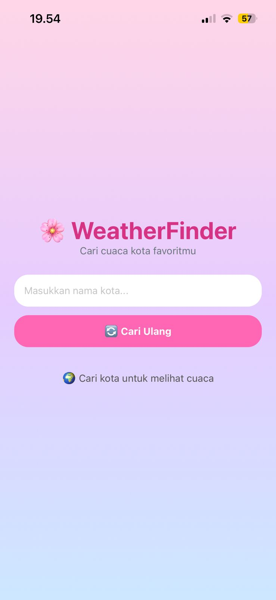
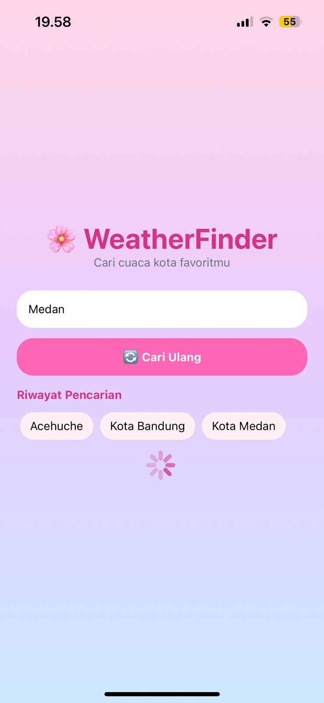
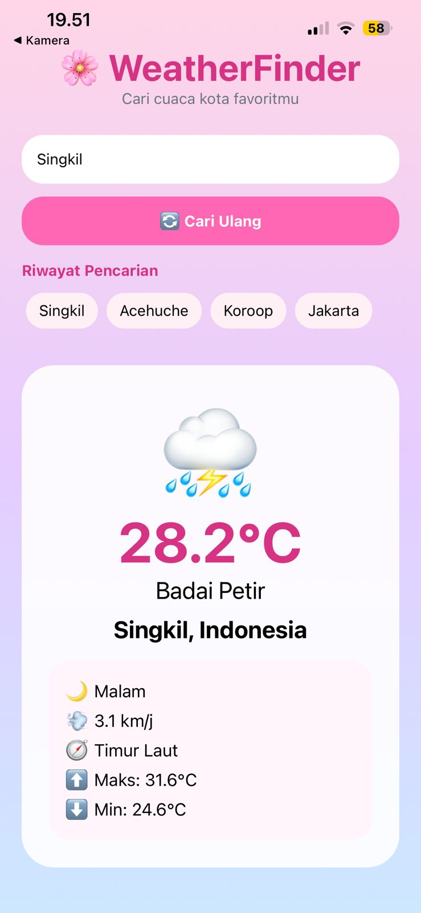
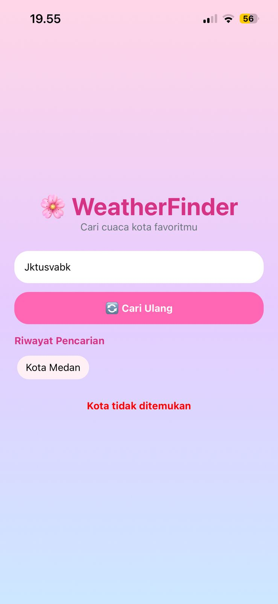

# 🌸 WeatherFinder

Aplikasi cuaca mobile berbasis React Native dan Expo yang menggunakan Open-Meteo API untuk menampilkan informasi cuaca secara real-time berdasarkan nama kota yang dicari pengguna.

## 📱 Fitur Wajib

* Controlled Component (TextInput)
* Debounce 500ms menggunakan setTimeout dan clearTimeout
* useEffect dengan dependency array
* Fetch API 2 langkah (Geocoding → Forecast)
* AbortController untuk membatalkan request lama
* Weather Code Mapping (WMO)
* Empty State
* Loading State
* Error State
* Success State

## ✨ Fitur Tambahan (Level 2)

* Riwayat Pencarian (5 kota terakhir)
* Tombol Refresh (Cari Ulang)
* Arah dan Kecepatan Angin
* Indikator Siang / Malam
* Suhu Minimum dan Maksimum Harian
* Tampilan UI Tema Pink Pastel

## 📸 Screenshot

### Empty State



### Loading State



### Success State



### Error State



## 🛠️ Tech Stack

* React Native
* Expo SDK 54
* JavaScript
* Open-Meteo API

## 🌐 API

### Geocoding API

https://geocoding-api.open-meteo.com/v1/search

### Forecast API

https://api.open-meteo.com/v1/forecast

## 🚀 Cara Menjalankan Project

1. Clone repository

```bash
git clone https://github.com/misyesinaga1-alt/WeatherFinder.git
```

2. Masuk ke folder project

```bash
cd WeatherFinder
```

3. Install dependency

```bash
npm install
```

4. Jalankan aplikasi

```bash
npx expo start
```

5. Scan QR Code menggunakan Expo Go.

## 🧪 Pengujian

### Empty State

Menampilkan pesan ketika pengguna belum memasukkan nama kota.

### Loading State

Menampilkan ActivityIndicator saat proses fetch data berlangsung.

### Success State

Menampilkan informasi cuaca ketika data berhasil diperoleh.

### Error State

Menampilkan pesan kesalahan jika kota tidak ditemukan.

### Debounce Test

Request API hanya dikirim setelah pengguna berhenti mengetik selama 500 ms.

## 👩‍💻 Developer

Misye Retno Wulansari Br. Sinaga

## 🔗 Repository GitHub

https://github.com/misyesinaga1-alt/WeatherFinder

## 🔗 Expo Snack

(Tambahkan link Expo Snack di sini setelah dibuat)
